# IGN data on videogames reviews
Analysis on IGN ranking of videogames

## The data

### IGN reviews
Imagine Games Network ([IGN](http://www.ign.com/games/reviews)) is a media company covering the video game industry. They have records of game reviews from 1995. Each game has a specific platform, a release date (year, month) and a genre. Each game is then rated from 0.1 to 10.

We state the hypothesis that this media cover a wide number of games at each moment, and that their rating is a fair appreciation over the whole period of time.

### Origin
The dataset can be found on the [kaggle](https://www.kaggle.com/egrinstein/20-years-of-games) website. It was build using a crawling script to analyse the IGN database.

## Our goal

Given this set of data, we want to dig through those 20 years of records to understand the short evolution of the gaming industry. We are epecially interested if we can find some trends within the industry that can explain the relative success or failure of some games. 

We think the two main factors are the *genre* of a game and the *platform* supporting it.

# Analysis

## Overview: 20 years of games 

Our first task is to understand the general shape of our dataset. This way we can understant some flaws and drive our further exploration.

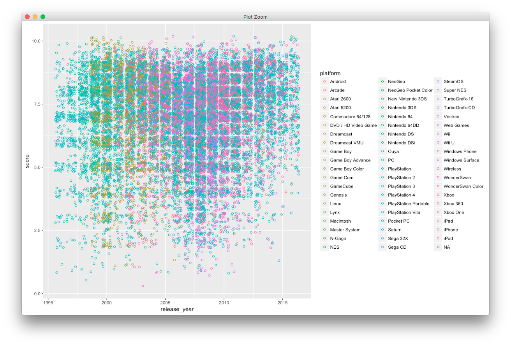

The next graph presents the number of games published, with the appreciation they received. The appreciation is directly linked with the note.

 - 10: Masterpiece
 - 9-9.9: Amazing
 - 8-8.9: Great
 - 7-7.9: Good
 - 6-6.9: OK
 - 5-5.9: Mediocre
 - 4-4.9: Bad
 - 3-3.9: Awful
 - 2-2.9: Painful
 - 1-1.9: Unbearable
 - 0-0.9: Disaster
 
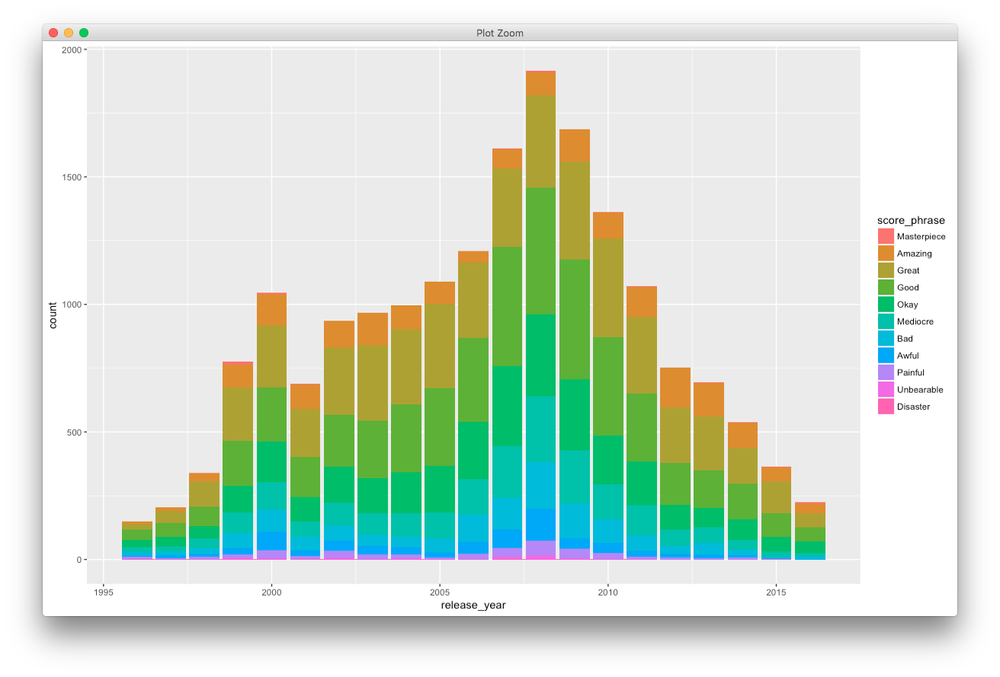

It is clear that this dataset features both many *genres* and many *platforms*, resulting in a lot of categories. That's why we may restrict some part of our analysis to a susbset of data.

We also observe a strange repartition of the number of rating along the year so we need to keep it in mind in the further work.

## Temporality

### Evolution over the years

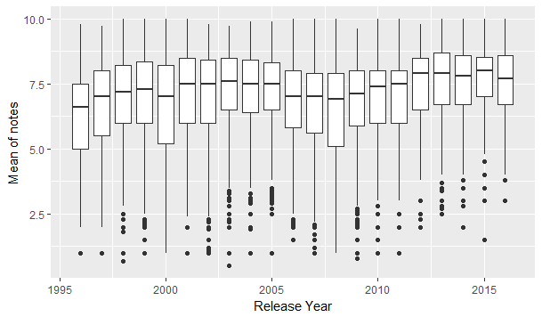

The first analysis we make from this plot is that the notes are in average pretty high. It is always above 5, concentrated in the range 6 to 9. We notice some little variation, but no year is especially better or worst than the others. For some years notes are more concentrated around the mean. 

As seen in the first graphs, the number of games per year is extremely varying. As expected, there was few games in the late 90's, because it was the beginning of the industry. Then we can notice an increase in production until 2008. 

Rather suprisingly, it is decreasing after 2008. We think it is more related to the editorial line, maybe restricting the number of game tested or even the amount of ressources allocated to gaming. Or maybe, IGN does rate older games along with latest release which could explay why not that many games from the last 3-4 years haven't been reviewed yet.

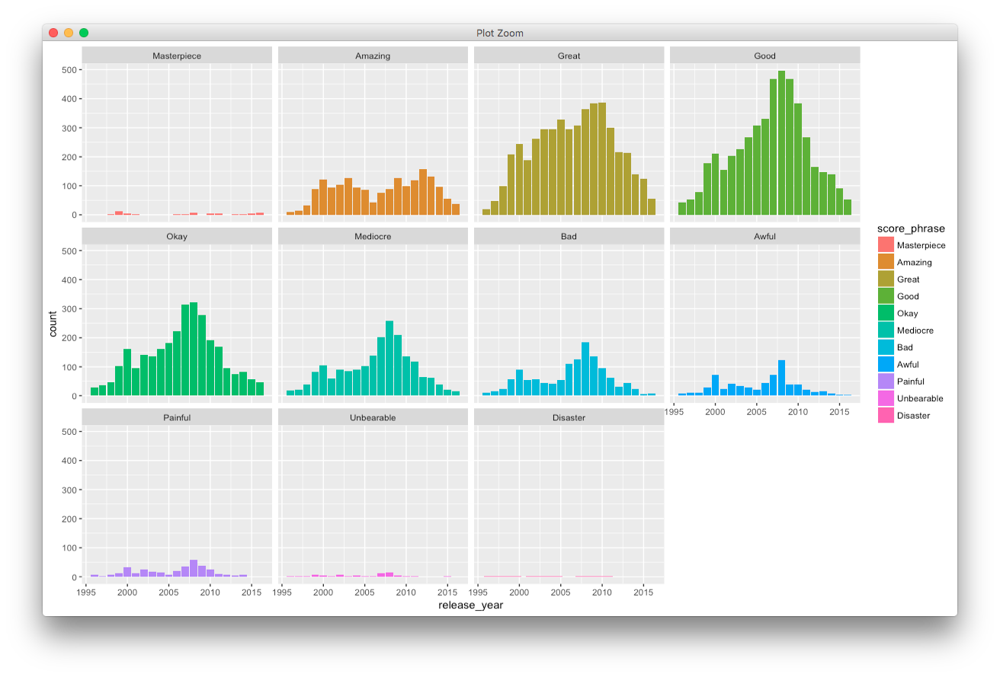

In this plot, we can confirm that a lot of games are reviewed as good, and great.

### Cycle of a year of release
We are now interested of the tendance during the year. Are the games published uniformely during the year, or is there pics ?

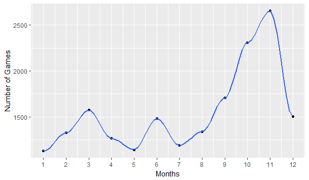
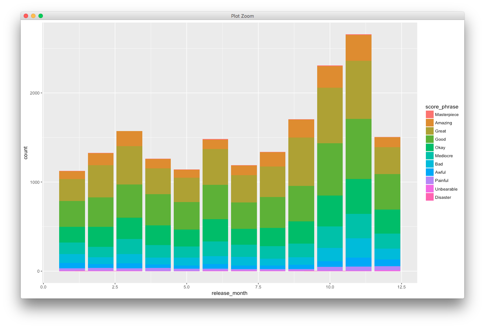

As we can see in these plot, we notice a huge number of release in november, and two small pics in March and in June. The pic of November can be explained by the proximity with Christmas.

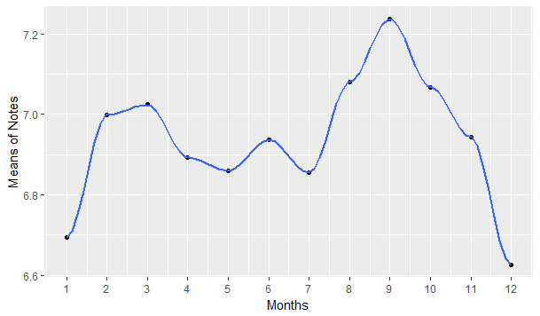

It is interesting to notice that even if the majority of games are released before Christmas, the best marked games are published in September. However we cannot really conclude because the difference in mean, and the first and third quartile is not extremely visible as we can see in the next plot.
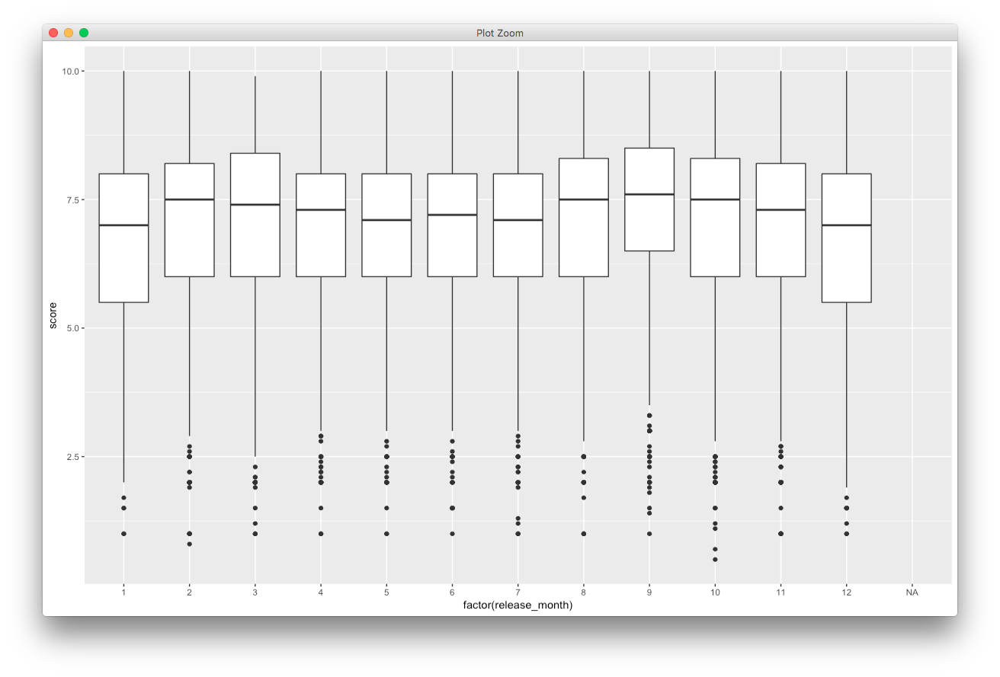

## Platform: Analysing two series of consoles

We decided to focus our study on two majors producers, **Nintendo** and **Sony**. With the years, platforms have evolved, and some might not be available anymore. 

We want to see with this short example if there exists some patterns around cycles of console generation.

### Sony's PlayStation

First we decide to take a look at the PlayStation serie.

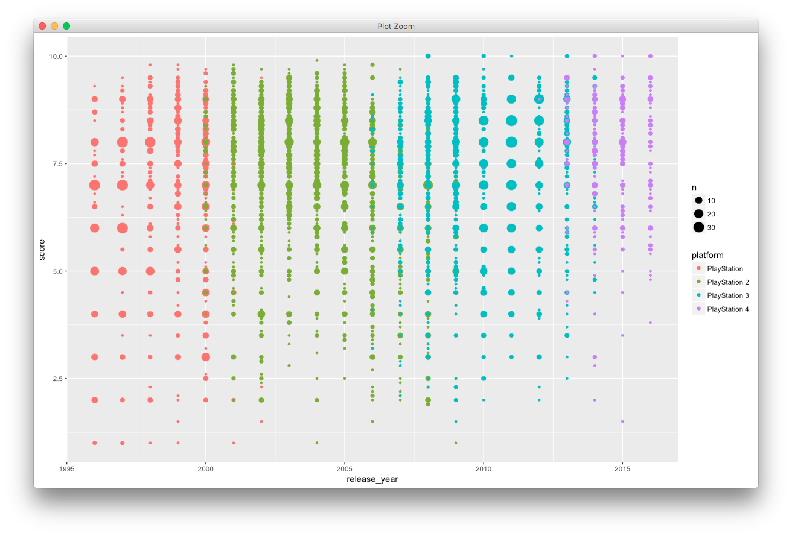

We can notice the living time of each console, and the overlapping between two generations of consoles.
We cannot conclude that a platform have noticeably received better critics than another.

### Nintendo's saga
Our second serie will be the consoles from Nintendo.

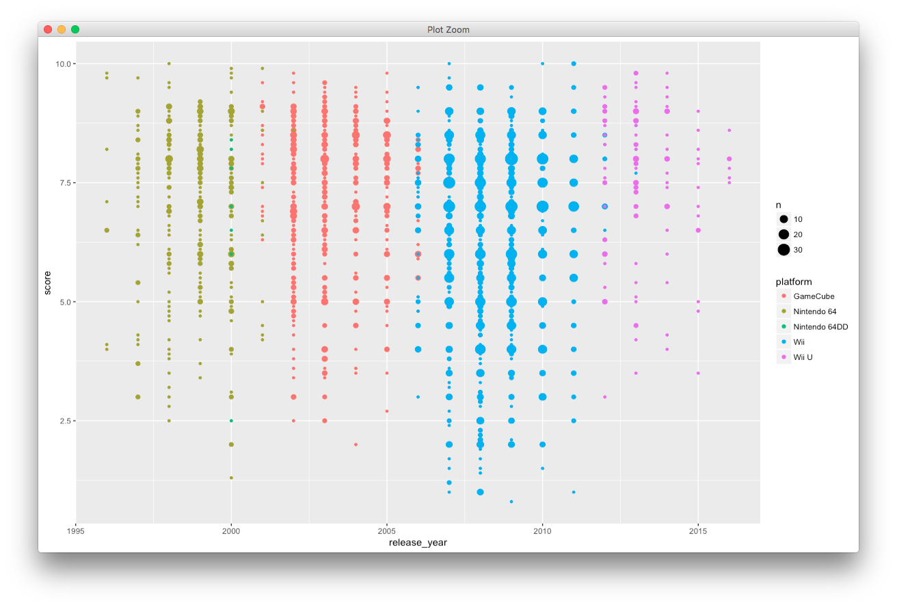

Here we can observe some irregularities. It seems the Wii as received more attention with more games tested and that the general shape of the rating is lower than the others.

It is worth noticing that for both companies, some very good games may show up, even if the next generation of system is available for more than a year.

It is also to notice that games published nowadays are often supported on several generations of consoles (Wii, Wii U for example) but the dataset does not aknowledge this. Probably a media company don't want to spend too much time testing on older systems.

### Zoom into a generation

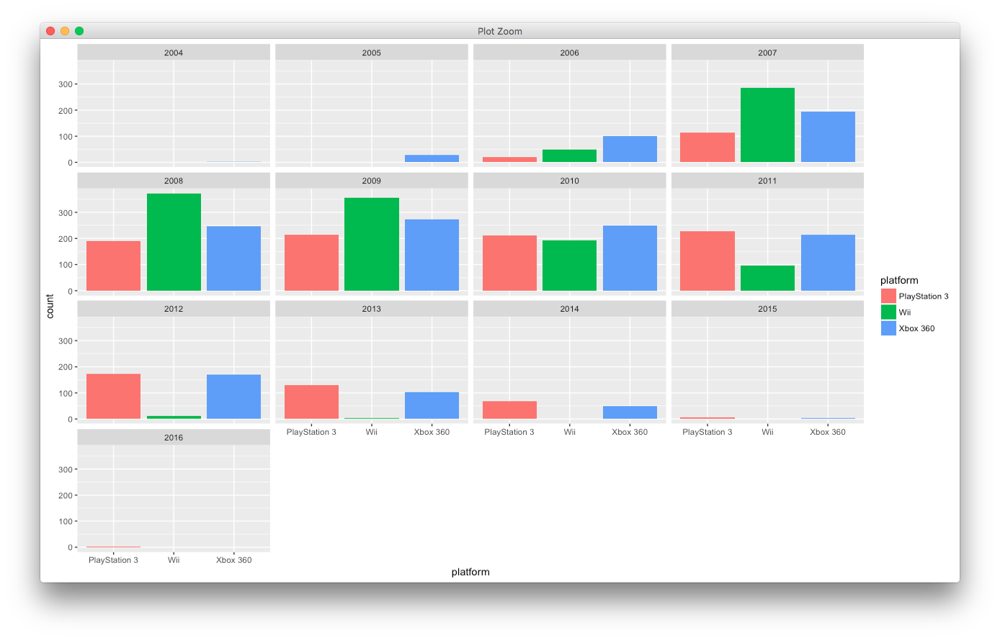

Interested in this comparison between companies, we try to focus on a single generation of the same kind of console: **Wii**, **PlayStation 3** and **Xbox 360**. Something worth noticing is the apparent lifetime of the wii is shorter than the **PlayStation 3** or the **Xbox 360**.

We can relate this to the release of the **Wii U** in Nov 2012. Its reception by the public was not a success: people did not understood the difference with the Wii. It may have been a mistake for Nintendo to not let the **Wii** finish it lifecycle more slowly.

## Genre: the moving waves

Our last interest is how our statistics depends on the genre of the games. Please note we restricted our analysis to the main genre (gathering more than *90* of the database).

### Rating

With this histogram displaying the repartion of ratings along different genre, we don't observe much impact of the repartition. The distribution of grades appears to be quite the same as the overall distribution.

### Temporality

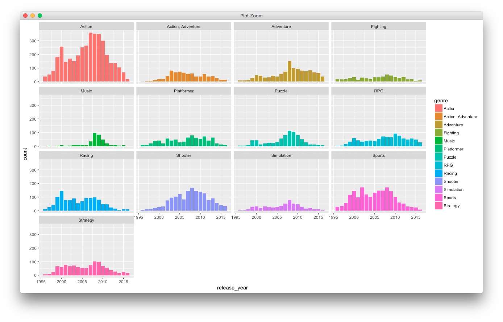

This diagram is much more interesting because it demonstrate some differences between the genre. Let's keep in mind that the general shape of the data features two spikes, a little in 2000 and the major one in 2008.

First we can see that some genre came early into the industry like **racing** or **sport**. They were present in 2000 but relatively less important in 2008 and declined  since then more rapidly than other genre. 

Second some genre have late impact like **adventure** or **shooter** kicking off around 2003 and maintaining a good relative number of releases.

Then come the case of **music** related games, with what seems to be a single spike around 2008 and not much since then.

Finally we can see that the overall winner is **action**, by being the predominant genre in the whole period. 

We think all those tendencies can be explained by the technical chalenges raised by the production of a game. In early days, the hardware capabilities and the development environments may prevent the exploration of genre requiring huge immersive worlds, or even interactions between players over the internet.

# Conclusion

This dataset appears to be complex to analyse due to the inconsistency of the rating, the huge number of categories (genre, platforms) but we do observe a few thing about the gaming industry. 

It is a good experience to find those links between the data and the real world.
